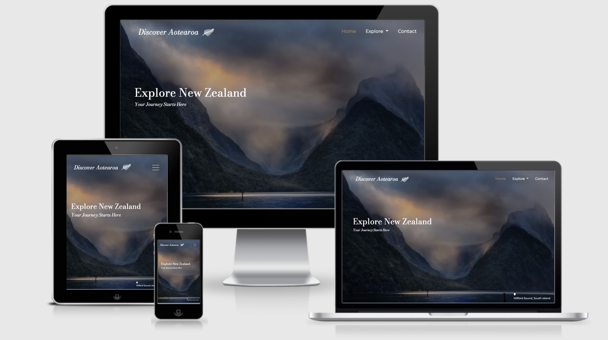
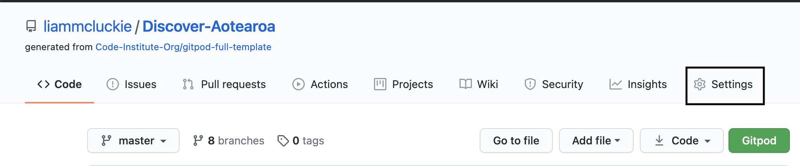
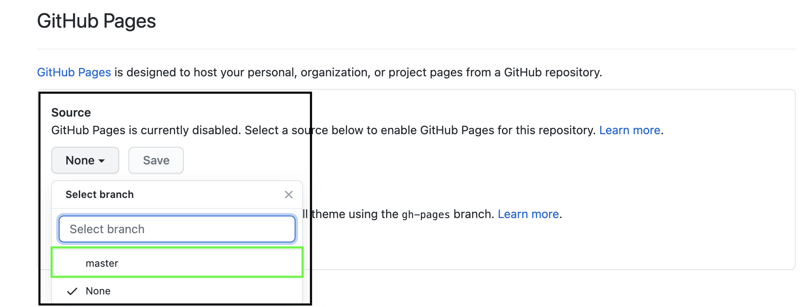
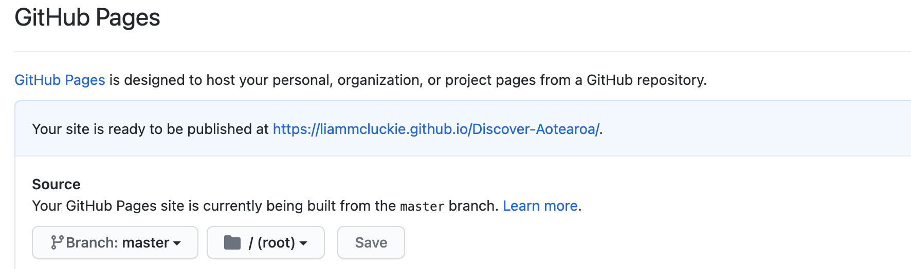
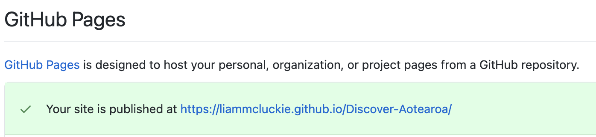
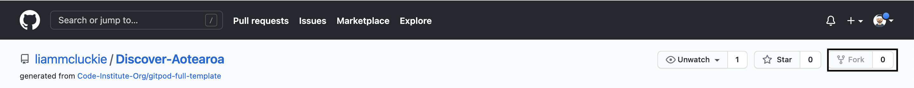
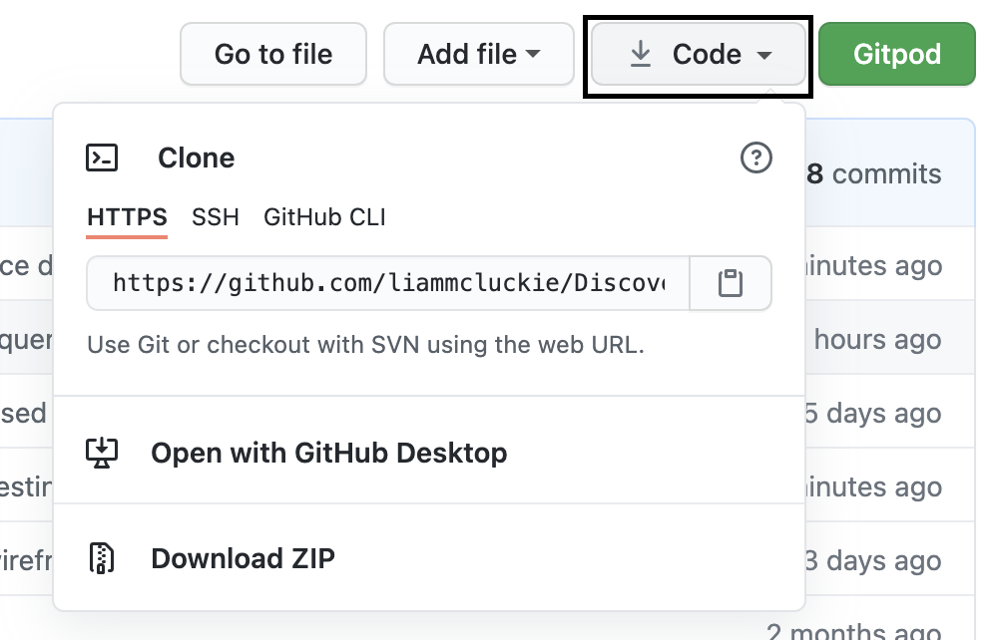

# Discover Aotearoa | Specialist Travel Website

[View Live Project Here](https://liammcluckie.github.io/Discover-Aotearoa/)

## Overview

This is the main website for a fictitious travel company who specialise in organising unique tailored holidays and trips all over New Zealand. Discover 
Aotearoa's website will be responsive on all devices focusing on mobile first design, whilst ensuring all visitors have an excellent user 
experience. This website will be aimed at users looking to organise a travel experience whilst receiving recommendations and tips through the 
websites content. All of this readily available information will be displayed clearly and in hierarchy of importance on each page, as well as in the 
navigation bar, through interactive features, internal website links showing the user further information on specific topics, and aesthetically pleasing,
relevant imagery of New Zealand and it's destinations. 

## Table of Contents

### 1. [UX](#ux) 
    
#### 1a. [User Stories](#user-stories)

#### 1b. [Business Goals](#business-goals)

#### 1c. [User Centered Design](#user-centered-design)
- Strategy 
- Scope 
- Structure 
- Wireframes

### 2. [Design](#design)
- Colour Scheme
- Typography
- Imagery

### 3. [Features](#features)

### 4. [Technologies Used](#technologies-used)
- Syntax
- Frameworks, Libraries & Programs

### 5. [Testing](#testing)
- [Testing Document](TESTING.md)

### 6. [Deployment](#deployment)
- GitHub Pages
- Forking the Repository 
- Cloning the Repository

### 7. [Credits](#credits)
- Resources
- Code 
- Content
- Media
- Acknowledgements

## UX

### User Stories

- **User Goals**

    a. As a user, I want to be able to access the site from any device.

    b. As a user, I want to easily navigate to other pages on the website regardless of the current section that I'm viewing.

    c. As a user, I want to find links to the businesses social media pages.

- **First Time Visitor Goals**

    a. As a first time visitor, I want to immediately understand the purpose of the website and what the business is offering.

    b. As a first time visitor, I want to see relevant and important information without having to scroll a lot or navigate far 
    from the landing page.

    c. As a first time visitor, I want to see offers or recommendations with a small amount of initial information about these.

- **Returning Visitor Goals** 

    a. As a returning visitor, I want to find out further information on the processes and steps required to book travel using this business.

    b. As a returning visitor, I want to find out more detailed travel advice on specific locations, attractions, accommodation and restaurants.

    c. As a returning visitor, I want to easily find imagery that is informative and relevant to my travel interests.

- **Frequent Visitor Goals** 

    a. As a frequent visitor, I want to find real-time flight information to help with my booking process.

    b. As a frequent visitor, I want to be able to contact the company to make a booking or enquiry directly through the website.

    c. As a frequent visitor, I want to be able to locate and explore exact places of interest on a map feature.

[Back to Table of Contents](#table-of-contents)

## Business Goals

- The main goal of this website is to convert visitors into customers, it's primary focus is to show users that the content and information
of this website has been created by people who are experienced in travel specifically in New Zealand. 

- The content provided by this business is to ensure that every step of travel is covered from flights and accommodation, to attractions and 
where to eat. It will also provide recommendations on which locations they may want to visit and why, and further information on what to do when 
visiting these destinations. The purpose of this is so that users can book and organise their whole trip in one location, therefore, removing the need 
to book each aspect through different websites, creating a highly in demand platform.

- Once a user has explored the website finding all the information required they will then have to contact the business with either a general 
enquiry or with details on their required booking. This will be easily found through a simple contact page that outlines the best practices for using 
the form, allowing for initial contact with the business to be a quick process and for rapport and trust to be quickly built.

[Back to Table of Contents](#table-of-contents)

### User Centered Design

#### Strategy

- With the main goal for this website to convert visitors into customers the use of aesthetically pleasing and dramatic imagery will be used to
draw the user in, followed by informative and useful information providing facts that interest the user and are relevant to their travel desires.

- The chance of the user converting to a customer heightens dramatically once they make contact with the business through the booking form. In order for
this to happen the website needs to be engaging with excellent user experience to keep the visitor from navigating away from the page before completing the 
contact form.

- This website is aimed at users who want to spend anywhere from three weeks to a few months travelling, with the idea of the trip being a once in a lifetime 
experience. The prices and overall cost of such things as flights, accommodation and attractions will be high which will reduce the relatable audience to that of
visitors who are not worried about price. Due to this the website will have a high end luxury feel to match.

#### Scope | Trade Off 

- **The main features and content in the initial design plan that are of highest priority are;**
    - Fully responsive website regardless of viewing device size.
    - Fixed navigation bar.
    - A recommendations section that includes top destinations and attractions.
    - The use of various API's to display real-time information to the user.
    - Interactive clickable features that allow the user to find relevant or further information.
    - Two different 'Explore' pages for both the North and South Island's.
    - A contact page that includes an easy to use form that sends emails to an account using [Emailjs.](https://www.emailjs.com/)
    - Internal page links that direct the user to further information if required.

- **The features and content in the initial design plan that are of a lower priority and may not be including in this build are;**
    - The use of various booking platforms and widgets integrated into the website.
    - Information regarding car and campervan hire.
    - Creating fixed price package trips that include multiple locations and attractions.
    - An 'About' page or section that includes information about the business.
    - A newsletter or blog subscription form.
    - Gallery page or section.

#### Structure 

- The basic structure of the website is;

- Navigation - *Top level*
    - The fixed navigation bar will allow users to navigate to all other pages regardless of the section they are currently viewing.

- Body - *Main page elements*
    - The main hero image's will be dramatic New Zealand landscapes that draw the users attention and aids in selling the websites product.

    - Buttons will be placed at important sections that allow the user to click the link and find out more. This is so that first 
    time users are not overloaded with information straight away.

- Footer - *Bottom level*
    - Mirroring the navigation bar to ensure the user can navigate the page easily.

    - Social media links placed here to ensure the user does not navigate away from the page to soon.

    - Copyright and legal information placed here.

[Back to Table of Contents](#table-of-contents)

### Wireframes

- [Desktop website view](wireframes/desktop.pdf)

- [Tablet website view](wireframes/desktop.pdf)

- [Mobile website view](wireframes/desktop.pdf)

### Design
 
#### Colour Scheme

- The colour scheme for this website is based on a well known colour scheme of black and gold. I have altered this to better suit the aesthetics of the project using a raw umber shade in 
place of gold and a very light pink to balance these two striking and bold colours. These colours will also tie in with the imagery used especially the hero images for each page that will 
consist of dramatic and contrasting dark blues and greens as well as warm oranges. These natural colours help convey feelings of rest and relaxation which is key for travel, as well as 
portraying the colours associated with the New Zealand landscape. 

-  Black Tone (#0C0409) - This colour which has some small tonal changes from a normal black colour will only be used for the navigation bar and the footer. The reason for this is 
to represent New Zealands well known and recognisable *All Blacks* colour.

- Pig Pink (#F5EBE0) - Primary Colour - Used throughout the website as the background colour for all pages, a light grey pink colour that compliments the black used in the navigation and footer well.

- Raw Umber (#A58961) - Secondary Colour - Also described as a bronze/gold shade and a typical colour pairing with black, Raw Umber will also feature heavily throughout the website used for
borders and alternative background colours when using boxes/cards for content. This colour also works very well with the main hero imagery used on each page such as sand, beaches and sunsets.

#### Typography 

- There will be two fonts used throughout this website. The font used for the logo and headings is Bodoni Moda, for the remaining website content 
the Montserrat font will be used. Since both of these fonts are of the serif typeface Sans Serif will be used as the fallback font in case there 
is an issue when importing the fonts, or browsers not supporting these.

- **Bodoni Moda** - The reason this font is being used for the logo and headings is due to it's striking appearance and extreme contrast between
the thick and thin lines in the text. This will immediately catch the users attention and direct them to the most important parts of the page.

- **Montserrat** - This font is an ideal pairing with Bodoni Moda and works perfectly for content due to its clean, simple lines that don't draw 
attention away from the other important aspects on the page. Due to it's popularity this is a font that many users will be familiar with evoking a feeling 
of comfort and trust as well as being aesthetically pleasing.

#### Logo

- A very simplistic and minimal logo was used for this project consisting of the company name in the **Bodoni Moda** font that is consistently used throughout the website. Alongside this 
the globally recognised white New Zealand fern designed by [the Noun Project](https://thenounproject.com/term/silver-fern/379641/) was used to immediately convey to the user what and where
this websites focus is.

#### Imagery 

- The type of imagery used within this website will be of great importance as this is what will be used to initially convince first time users 
that planning a trip to New Zealand is the right decision. This will be done by using dramatic and eye catching landscape imagery that really displays
the beauty of the country. Firstly, this will be achieved by a full screen hero image displayed at the top of each page that not only conveys what the website is 
about but will also make the user want to see more.

- Images will also be used to convey information and work alongside text content, this will be especially important when displaying what attractions, destinations
and restaurants are available or recommended. The images used to inform the user of different attractions available will be more of a documentary style telling a story of what the user 
could experience should they visit these places.

- For informing and showing the user the possible destinations available to visit the imagery will be mainly dramatic and intriguing landscape shots showing the beauty of a particular area.
This will automatically make the user want to see more of this destination and increase the likelihood of them wanting to visit whilst on their trip.  

- There will also be the use of font icons throughout the website imported from [Font Awesome.](https://fontawesome.com/) These will be used in a way to further 
enhance certain sections on the website such as flights, accommodation, travelling and planning. By using these icons in a way that isn't excessive it will add 
a professional and clean aesthetic feel to the website.

[Back to Table of Contents](#table-of-contents)

### Features

#### Existing Features Used Throughout the Project

- Responsive on all screen sizes and devices.

- Collapsible navigation bar when viewed on smaller screen sizes.

- [Animate on scroll](http://michalsnik.github.io/aos/) a Javascript library to load elements on the page as the user scrolls.

- The appearance on all buttons and links alters when the user clicks or hovers.

- A working and connected newsletter sign up form at the bottom of all pages apart from the contact page, this automatically sends the user an email response thanking them for signing up.

- Success or error messages that will display depending on if the user correctly or incorrectly uses the forms on the website.

- A fixed navbar that the background colour changes from no colour to black as the user starts to scroll down the page.

- Custom 404 error page created to enhance UI if an incorrect page is searched for.

#### Specific Landing Page Features

- Two responsive carousels used to display popular destinations and popular attractions. These are fully responsive and work extremely well on touch screen devices due to the ability of
swiping left and right to change the image displayed instead of always using the chevron button. The initial code for the carousels was taken from [Flickity](https://flickity.metafizzy.co/) 
and customised for this project.

#### Specific North & South Island Page Features

- [Skyscanner API](https://rapidapi.com/skyscanner/api/skyscanner-flight-search) used to display flights to different locations taken from the Skyscanner database. The flight information 
consists of destinations, airline and price.

- [Google Maps API](https://developers.google.com/maps/documentation/javascript/overview) used to show the user the destination they are interested in on the map.

- Google maps markers used alongside the Google maps places functionality used to display clear markers on the relevant locations as well as display local businesses within a certain radius
such as restaurants, accommodation and tourist attractions.

- [Bootstraps](https://getbootstrap.com/docs/4.6/components/card/) card layout code is used to display the 'Top Pick' information for each destination, this code was then customised to better
suit the aesthetics of this project.

- A simple table that is used to display the flight information when the user selects the destination they are interested in.

- Internal page anchor links and buttons are heavily used throughout the destinations section in order to better improve the UX so that when the user clicks on a button the page moves to the relevant 
information in order to reduce the users scroll time.

#### Specific Contact Page Features

- A detailed contact from that allows the user to inform the website of the trip they would like to book including travel dates and interested destinations.

- A fully connected and validated contact form using [EmailJS](https://www.emailjs.com/). This not only sends the users enquiry to the website but also sends an automatic response to the user
informing them that their request has been received as well as including their original request in the response email for them to check over.

### Future Features 

- Include possible booking widgets/travel relevant API's so that users can book directly through the website without needing to navigate away or complete the contact form.

- Add a blog page that includes posts about real travel stories to New Zealand.

- Create a gallery page that mirrors an real life Instagram feed showing images posted of the websites users on their trip.

- Include a search bar that allows the user to find all content relevant to either a location or an attraction.

- Create a separate contact modal form for general enquires and then adapt the current contact page to be a further details booking form e.g allow the user to select specific attractions or 
activities they would like to do on their trip, as well as include flight options in the form.

- Customise the [Google Maps API](https://developers.google.com/maps/documentation/javascript/overview) aesthetics further to create a more unique map for this site e.g. alter marker pin images 
and add further business content to info windows.

[Back to Table of Contents](#table-of-contents)

### Technologies Used

#### Syntax

- [HTML5](https://en.wikipedia.org/wiki/HTML5)
    - HTML5 is a markup language used for structuring and presenting content on the internet.

- [CSS](https://en.wikipedia.org/wiki/CSS)
    - Cascading Style Sheets (CSS) is a style sheet language used for describing the presentation of a document written in a markup language such as HTML.

- [Javascript](https://en.wikipedia.org/wiki/JavaScript)
    - Javascript is a lightweight, interpreted, object-oriented language with first-class functions, and is best known as the scripting language for Web pages, but it's used in many
    non-browser environments as well.

- [JQuery](https://jquery.com/)
    - jQuery is a JavaScript library that allows web developers to add extra functionality to their websites. It is open source and provided for free under the MIT license.

#### Frameworks, Libraries & Programs

- [Balsamiq](https://balsamiq.com/)
    - The Balsamiq application was used to create wireframes for each website page on various device screen sizes.

- [Font Awesome](https://fontawesome.com/)
    - Used to display icons on the landing page and the social media icons in the footer.

- [Bootstrap](https://getbootstrap.com/)
    - Bootstrap was used throughout the site for responsiveness using the grid system, the navigation bar, the form on the contact page, and the table displaying flight information.

- [Google Fonts](https://fonts.google.com/)
    - Used to import the two fonts used throughout the site 'Bodoni Moda' and 'Montserrat'.

- [Hover.css](https://ianlunn.github.io/Hover/)
    - A library consisting of various hover effects that are available to use. They feature throughout this site on the majority of links and buttons, effects used were hover shrink, hover grow
    and underline from center.

- [JQuery](https://jquery.com/)
    - Used alongside the [Bootstrap](https://getbootstrap.com/) library in order for the collapsible navigation bar to correctly work. As well as this it was used instead of vanilla Javascript
    to reduce the amount of code used and speed up the writing of certain functions.

- [GitHub](https://github.com/)
    - Used to host the entire repository for the project.

- [GitPod](https://gitpod.io/workspaces/)
    - The code editor used to build the entire project.

- [GitHub Pages](https://pages.github.com/)
    - Used to host the live version of the website as well as integral to aid in the de-bugging of the project specifically for cross browser and various device testing.

- [TinyPNG](https://tinypng.com/)
    -  Used this to compress all the images used on the website to decrease the file size and increase website load speed.

- [Flickity](https://flickity.metafizzy.co/)
    - A Javascript slider library used to create responsive image carousels of various styles, it is also touch responsive so works extremely well on touch screen devices. This was used
    to create both carousels for the Landing Page.

- [Favicon](https://favicon.io/)
    - Used to generate the websites favicon logo of various sizes for different devices.

- [AOS](http://michalsnik.github.io/aos/)
    - Animate on Scroll is a Javascript Library that adds various scroll effects on chosen elements on a webpage. It was used on the main elements on each page of this project to give a 
    'fade up' effect to add to user interactivity as well as aesthetics.

- [Imgur](https://imgur.com/)
    - An online image sharing and image hosting application. This was used in this project to host all carousel images, due to the type of carousel used the images needed to be inserted
    through hosting links that Imgur provides.

- [Skyscanner Flights API](https://rapidapi.com/skyscanner/api/skyscanner-flight-search)
    - An API that allows you to fetch flight data from the Skyscanner database to display on your website.

- [Google Maps API](https://developers.google.com/maps/documentation/javascript/overview)
    - Allows you to display the well known Google Maps program within your website, the API allows for a huge amount of functionality and customisation allowing you to display data to 
    the user as they would expect it to appear from previous use of Google Maps.

- [Am I Responsive](http://ami.responsivedesign.is/)
    - A tool to check how the website appears and the functionality on various devices. The image at the top of this document was generated from this website.

- [Responsinator](http://www.responsinator.com/)
    - Similar to [Am I responsive](http://ami.responsivedesign.is/) this is a web based application that allows a website to be checked an a large amount of devices in portrait and 
    landscape view.

- [W3C Validator HTML](https://validator.w3.org/) & [W3C Validator CSS](https://jigsaw.w3.org/css-validator/)
    - Both of these were used to test all the code for the project whilst working and for the finished website to check for valid HTML and CSS.

- [JSHint](https://jshint.com/)
    - This is a tool used to detect errors or potential problems within Javascript code, it was used to test and validate all Javascript written for this project.

- [CSS Autoprefixer](https://autoprefixer.github.io/)
    - This was used to add vendor prefixes to the CSS used in the project to increase cross browser compatibility.

- [BrowserStack](https://www.browserstack.com/)
    - This application was used to test the functionality and appearance of the project on all main browsers.

[Back to Table of Contents](#table-of-contents)

### Testing

Find all information on the testing that has been carried out for this project [here.](TESTING.md)

### Deployment

#### GitHub Pages

This project was built using [GitPod](https://gitpod.io/workspaces/).

1. Firstly a new repository was created and titled for this project.

2. During and once the project was completed all commits and code was pushed to said repository.

This project was then deployed using [GitHub Pages](https://pages.github.com/) by using the following steps, the instructional images contain a black box around the specified area.

1. Log in to [GitHub](https://github.com/) and locate this [repository](https://github.com/liammcluckie/Discover-Aotearoa).

    - Alternatively you can locate the repository by searching liammcluckie/Discover-Aotearoa on [GitHub](https://github.com/).

2. You will find at the top of the repository, below the repository title, a list of links. Click on the 'Settings' option.

    - Please note if you are viewing this on a smaller device you can locate the link in the same place but you will need to horizontally scroll to the left to view the link.

    

3. Scroll down the page until you reach the 'GitHub Pages' section.

4. Under the 'Source' label there is a dropdown box displaying 'None'. Click on this and change the source to 'Master Branch', the page will now automatically refresh.

    

5. Once the page has finished loading scroll back down to the GitHub pages section and it will be displaying the published website [link](https://liammcluckie.github.io/Discover-Aotearoa/).

    

    

#### Forking the GitHub Repository

This project is available to be copied and edited by other users without changing the repository on the original GitHub account. This can be done by forking the entire repository by following
these steps, the instructional images contain a black box around the specified area.

1. Log in to [GitHub](https://github.com/) and locate the [repository](https://github.com/liammcluckie/Discover-Aotearoa).

    - Alternatively you can locate the repository by searching liammcluckie/Discover-Aotearoa on [GitHub](https://github.com/).

2. At the top of the repository page, below your own account icon you will find three buttons one of these is labelled 'Fork' click here.

    

3. You will now have a copy of the entire repository in your own GitHub account to edit and make changes too.

4. If any suggestions, improvements or changes have been made that you would wish to share to improve the original site you can then submit a pull request to the project owner, details on
how to do this can be found [here](https://docs.github.com/en/github/collaborating-with-issues-and-pull-requests/creating-a-pull-request-from-a-fork).

#### Making a Local Clone

1. Log in to [GitHub](https://github.com/) and locate the [repository](https://github.com/liammcluckie/Discover-Aotearoa).

    - Alternatively you can locate the repository by searching liammcluckie/Discover-Aotearoa on [GitHub](https://github.com/).

2. Located directly above the repository files and to the left of the green 'GitPod' button is a 'Code' button click on this.

    

4. Next open your own terminal in GitPod and change the current directory to where you want the cloned directory to be sent to.

5. In the terminal type `git clone` and then paste the URL copied from the original repository and press enter. This will create your local clone.

6. If you use GitHub desktop the instructions on how to clone to this can be found [here](https://docs.github.com/en/github/creating-cloning-and-archiving-repositories/cloning-a-repository#cloning-a-repository-to-github-desktop).