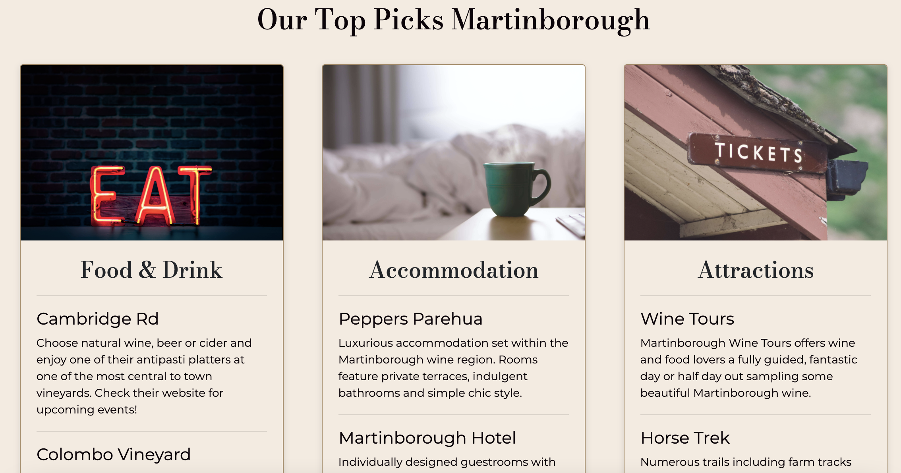

[Return to ReadMe file](README.md)

## Testing Table of Contents

### 1. [Code Validation](#code-validation)

### 2. [User Story Testing](#user-story-testing)

- [First Time Visitor Goals Testing](#first-time-visitor-goals-testing)
    
- [Returning Visitor Goals Testing](#returning-visitor-goals-testing)

- [Frequent Visitor Goals Testing](#frequent-visitor-goals-testing)

### 3. [Browser Compatibility and Device Responsiveness Testing](#browser-compatibility-and-device-responsiveness-testing)

### 4. [Google Lighthouse Testing](#google-lighthouse-testing)

### 5. [Further Testing](#further-testing)

### 6. [Bugs](#bugs)

## Code Validation

Throughout this project all code has been regularly ran through HTML, CSS and Javascript validators to ensure there are no errors within the code. See below screenshots of all validated
and passed code. Outlined for each page is the decision why the warnings present have not been corrected.

### [CSS Validation](testing/css-valid.png)

- The majority of warnings present relate to unknown prefix vendors that have been added by [Autoprefixer](https://autoprefixer.github.io/) to increase cross browser compatibility. These 
warnings have not been corrected due to this know being a necessary practice.

- Another warning present relates to some buttons on the website having the same border colour as background colour. This is due to the hover effect added to these elements that cause the 
background colour to be removed upon hover, so for aesthetic purposes the border colour needs to be present when this happens.

### [HTML Validation](testing/html-valid.png)

- No warnings present for any html pages within this project.

### Javascript validation

#### [Script.js](testing/script.js-valid.png)

- The undefined variables in this file that cause warnings have not been altered as they are correctly used however, JSHint does not recognise them.
    - 'AOS' is the necessary code for the animate on scroll library used.
    - The '$' is used inline with correct JQuery syntax, however, JSHint has not been told that JQuery is being used hence this warning.
    - 'emailjs' is the necessary code to allow the forms within the website to send emails as instructed.

- The unused variables in this file that cause warnings have not been altered as these variables are called within the HTML files and are necessary 
for the code to correctly work.
    - 'changeText' and 'defaultText' are called in the index.html page when the user hovers over the carousel destination/attraction heading.
    - 'subMail' is called on the newsletter form to correctly action and use the emailJS application.

#### [flights.js](testing/flights-valid/flights-valid-2.png) & [south-flights.js](testing/flights-valid/flights-valid.png)

- Both files show no warnings or errors present.

#### [maps-new.js](testing/maps-valid/maps-ni-valid.png) & [south-maps.js](testing/maps-valid/maps-si-valid.png)

- Both files show the same warnings regarding undefined variables all of which are caused from using necessary syntax to correctly use the Google maps API, these are 'map' and 'google'.
- Both files show the same warnings regarding unused variables which are caused from using necessary syntax to correctly place Google map markers on the API, this is 'marker'.

#### [email.js](testing/email-valid.png)

- The undefined variables in this file that cause warnings have not been altered as they are correctly used however, JSHint does not recognise them.
    - 'emailjs' is the necessary code to allow the forms within the website to send emails as instructed.

- The unused variables in this file that cause warnings have not been altered as these variables are called within the contact.html file.
    - 'sendMail' is called on the contact form to correctly action and use the emailJS application.

[Back to Testing Table of Contents](#testing-table-of-contents)

## User Story Testing

### User Goals

- *"As a user, I want to easily navigate to other pages on the website regardless of the current section that I'm viewing."*

    - This is possible due to the fixed navigation bar accessible on all pages regardless of the point in the page the user is viewing.

    

- *"As a user, I want to find links to the businesses social media pages."*

    - I decided to include links to useful travel related websites such as Tripadvisor and the New Zealand tourism website as I believe these 
    to be more valuable to the user than social media websites. These are found in the footer on each page.

    

### First Time Visitor Goals

- *"As a first time visitor, I want to immediately understand the purpose of the website and what the business is offering."*

    - This is clear to the user due to the way the hero image and text is formatted and structured in a way that clearly outlines that the websites
    main purpose is travel related.

    

- *"As a first time visitor, I want to see relevant and important information without having to scroll a lot or navigate far from the landing page."*

    *"As a first time visitor, I want to see offers or recommendations with a small amount of initial information about these."*

    - Both of these are achieved due to the relevant content on the landing page and the hierarchy it is structured in. Firstly it is simply and quickly
    explained to the user through three icons with three descriptive words, this ensures the purpose of the website is further clarified without the user
    needing to read a lot of content.

    

    - Secondly the inclusion of the two carousels that show the user popular destinations and attractions mean that from a quick glance they can gain an
    understanding of what is on offer with possible places to visit and things to do. This is done visually through striking imagery with the additional hover 
    option available on larger devices that offer further information on these.

    

### Returning Visitor Goals

- *"As a returning visitor, I want to find out more detailed travel advice on specific locations, attractions, accommodation and restaurants."*

    - All of this information is found on both the 'Explore' pages where the user can easily find all of this information can be found in the form of a
    brief overview of each destination and the 'Top Picks' section.

    

    

- *"As a returning visitor, I want to easily find imagery that is informative and relevant to my travel interests."*

    - This is further enhanced from the imagery used on the landing page carousels by including alternative images for each destination when selected.
    This imagery used is striking, impressive and has been chosen as it best documents that specific area.

    

### Frequent Visitor Goals

- *"As a frequent visitor, I want to find real-time flight information to help with my booking process."*

    - This is the first thing the user comes across once they navigate the either of the 'Explore' pages. They are informed of what this flight 
    information is, where it has come from and if they choose to they can book directly through the Skyscanner website or alternatively through the 
    websites contact form.

    

- *"As a frequent visitor, I want to be able to contact the company to make a booking or enquiry directly through the website."*

    - This is available through the simple contact form where it is required for the user to submit certain contact information and a message. However,
    they do not need to select travel dates in case the user would like to submit a more general enquiry instead of a booking enquiry.

    

- *"As a frequent visitor, I want to be able to locate and explore exact places of interest on a map feature."*

    - This is achieved in two steps, the first is when the user selects a destination the map displays a zoomed in view of this area along with a
    marker to further show which area they are viewing. Secondly, there is a button for each section of the 'Top Picks' that displays all relevant 
    places of interest within a certain radius as well as place info.

    

    

[Back to Testing Table of Contents](#testing-table-of-contents)

## Browser Compatibility and Device Responsiveness Testing

- This project was tested throughout the build on various device types and sizes using Google Chrome Developer Tools as well as other web based applications mentioned in the ReadMe 
document such as [Am I Responsive](http://ami.responsivedesign.is/) and [Responsinator](http://www.responsinator.com/) to ensure fluid and error free responsive design, screenshots from
this testing can be viewed [here.](testing/responsive-test/device-test.pdf) The deployed website was also continually tested on my own personal device of an iPhone 8 as well as an iPhone
11 to ensure the project worked as intended see screenshots below.

Once the project was completed a cross browser compatibility test on five different browsers was carried out using a web based application [BrowserStack](https://www.browserstack.com/). 
I also checked this testing by downloading the browsers that were available to double check on the testing.

This table below shows how all the projects pages responded on different device screen sizes and being used on various browsers, the grading key is as follows;

Good - Appears exactly as intended aesthetically and functionally

OK - Appears as intended functionally but some aesthetics may have slightly altered

Poor - Website still functions correctly but key elements do not appear as intended

[Back to Testing Table of Contents](#testing-table-of-contents)

## Google Lighthouse Testing

Once the main build of this project was completed a test for mobile and web was carried out for all pages using Google Developer Tools Lighthouse application. Using the report I then went
through the project and made as many recommended alterations as possible to improve the website inline with the areas that lighthouse focuses on. 

Below are two example screenshots of the overall report for desktop and mobile. To see reports for all pages in desktop click [here](testing/lighthouse-test/lighthouse-desktop.pdf) and 
for all page reports on mobile click [here](testing/lighthouse-test/lighthouse-mobile.pdf).

**index.html mobile report**

**south-island.html desktop report**

- The improvements made this project to increase lighthouse scores were;
    - Further reducing and compressing image sizes whilst still maintaining quality.
    - Removing any unused and unnecessary code that the report indicated.
    - Ensuring `META` tags have all the necessary information to improve SEO. 

## Further Testing

- All functionality and features of the entire website have been thoroughly tested, this includes all links internal and external, email forms and buttons.

- The live site was viewed and reviewed in the Code Institute Slack channel for 'peer-code-review' where only one minor changes were mentioned. This change focused on the UX of the destinations
section of the 'Explore' pages. The suggestion and implemented change was to remove the extra 'Explore' button that the user needed to select to display the 'Top Picks' content as it was
described as an unnecessary step and the user expected this information to display from the first 'Explore' button. See details below.

[Back to Testing Table of Contents](#testing-table-of-contents)

## Bugs

Listed below are the major bugs that I encountered whilst building this project and how I resolved them.

1. The first bug encountered during this project was caused when adding the landing page hero image as a background image as was needed to achieve the desired aesthetics. When doing this
it had an effect on the navigation bar and more specifically the functionality of the collapsed burger icon causing it to not work as intended. 

    This bug was resolved by wrapping the whole navbar code in a separate `div` container and adding the `background-image` css code to this container instead of the original navbar container.
    Problems were still being caused by the size of the hero image which was then resolved by changing the image height from `100%` to `100vh` in order to always fill the users viewport height.

        #landing-nav-wrapper {
        background: -webkit-gradient( linear, left top, left bottom, from(rgba(0, 0, 0, 0.3)), to(rgba(0, 0, 0, 0.3)) ), url("../images/landing-page-hero.jpg") no-repeat center;
        background: -o-linear-gradient( rgba(0, 0, 0, 0.3), rgba(0, 0, 0, 0.3) ), url("../images/landing-page-hero.jpg") no-repeat center;
        background: linear-gradient( rgba(0, 0, 0, 0.3), rgba(0, 0, 0, 0.3) ), url("../images/landing-page-hero.jpg") no-repeat center;
        background-size: cover;
        height: 100vh;
        position: relative;
        }

2. Another bug caused within the header section of this project effected the responsiveness when viewing the website on small and medium sized devices the collapsed hamburger icon as well 
as the hero image location text kept getting pushed off the screen and also caused overflow and horizontal scroll. 

    This bug was caused by the positioning of the hero image text 'Explore New Zealand', since this was positioned using `absolute` and the incorrect parent container was positioned using 
    `relative` hence the effect on incorrect positioning of other elements within the container. This was then resolved by identifying the correct parent container and giving assigning this
    `position: relative;`.

3. When writing the first Javascript for this project I wanted to display a success message when the user signed up to the newsletter, I was initially attempting to achieve this by selecting 
the class of the message that was set to `display: none;` and then toggling the `classList` to allow it to be visible. I well also trying to target the desired element through the `form` tag
instead of targeting the specific `id`.

    By making the necessary changes and then incorporating this into a function that also used emailJS correctly I managed to achieve the desired effect.

        (function () {
            emailjs.init("user_7Zuhihp6HZgdp93yn7Cpc");
        })();

        function subMail(subForm) {
            emailjs.send("service_vg6mnxa","subscriber", {
            "from_email": subForm.newsletter_email.value,
        })
        .then(
            function success(event) {
                const success = document.getElementById("newsletter-success");
                success.style.display = "block";
                event.preventDefault();
                console.log("success");
            }
        );
            document.getElementById("newsletter-form").reset();
            return false;
        }

4. When using [Flickity](https://flickity.metafizzy.co/) for the carousels on the landing page to achieve the desired effect needed I couldn't use any of the default carousel types in 
their library which meant I had to take code from multiple different examples and combine these together to create the carousel necessary. 

    This caused two major bugs, one of which was inserting the images into the carousel cell so that it fit correctly and displayed as it should, initially this was being done as normal
    by using the `src` attribute within the `img` tag which did not work correctly. Through extensive reading through documentation I discovered that because of the code I used I needed 
    to insert my images through direct links but using the in-built [Flickity](https://flickity.metafizzy.co/) attribute of `data-flickity-lazyload="insert-link-here"`, this initially
    made everything work correctly. 

    Upon validating my HTML through [W3C Validator HTML](https://validator.w3.org/) a major error flagged was caused by using the `img` tag without a `src` attribute this was then corrected 
    by doing this but leaving the images to be inserted through direct links using [Imgur](https://imgur.com/). This then resolved the [W3C Validator HTML](https://validator.w3.org/) errors,
    however, when completing cross browser testing the carousels would not correctly display on Safari (see image below).

    This final bug was then resolved by leaving one image in each carousel to be inserted through the built in `data-flickity-lazyload="insert-link-here"` code and then to ensure there were
    no validation errors on the `img` tags that used this an empty a src tag was still included e.g `src="#"` which resolved all bugs and errors.

     

    [Back to Testing Table of Contents](#testing-table-of-contents)

    [Return to ReadMe file](README.md)